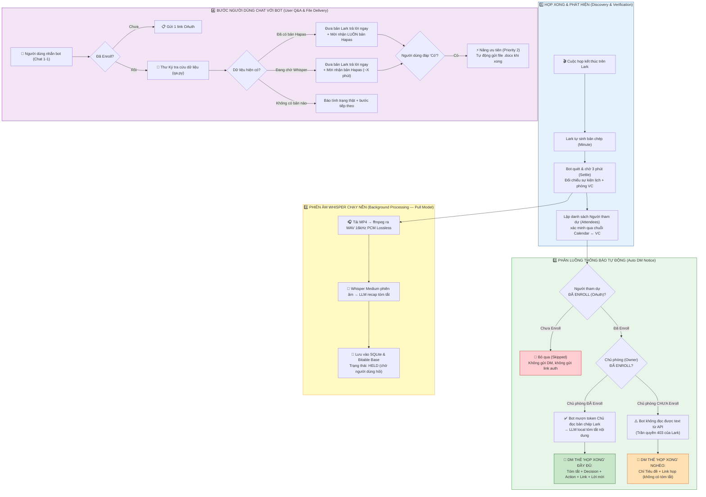
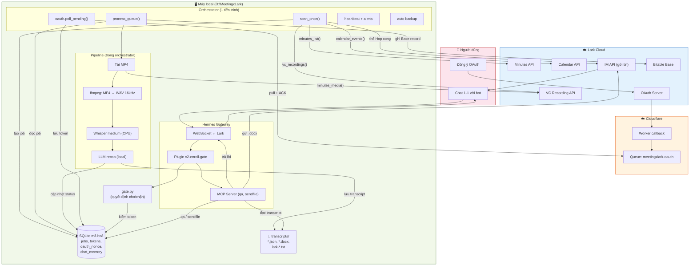
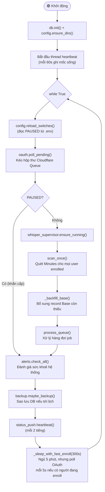
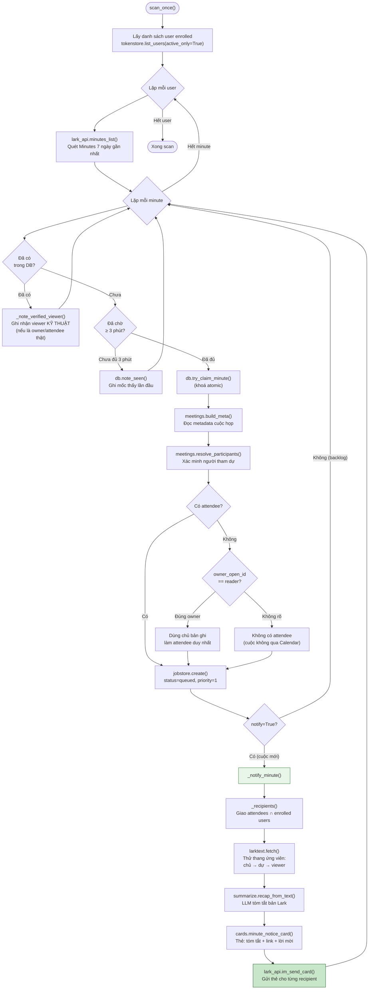
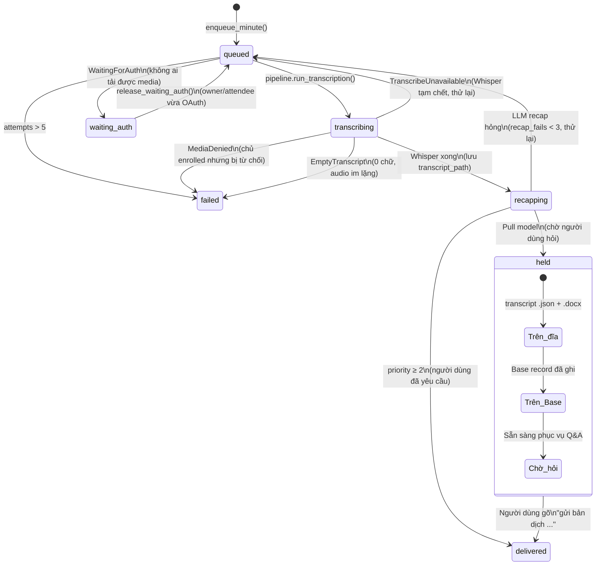
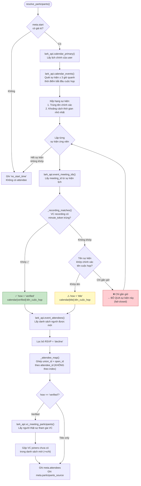
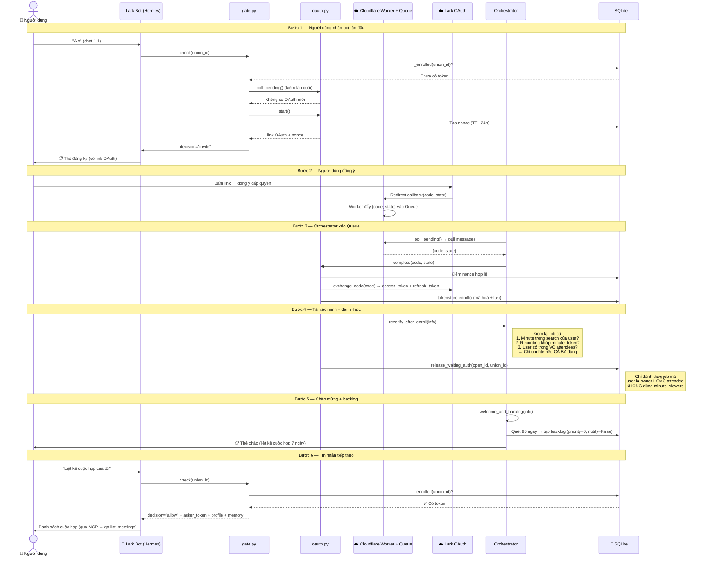
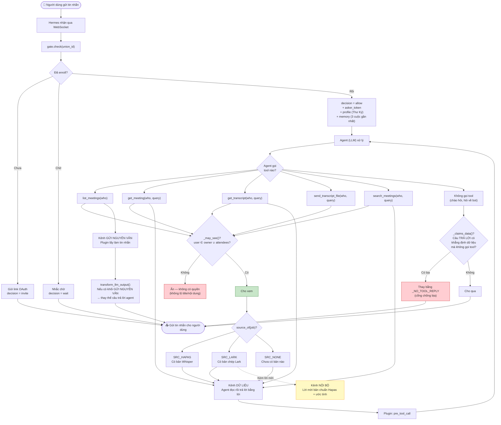
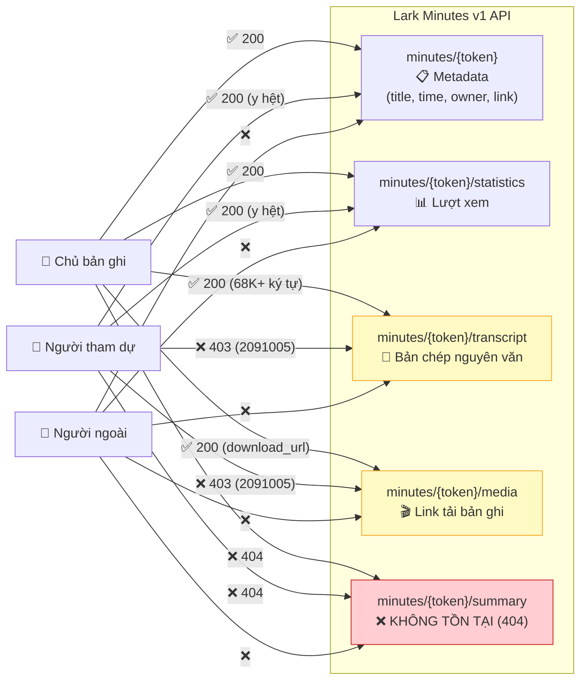
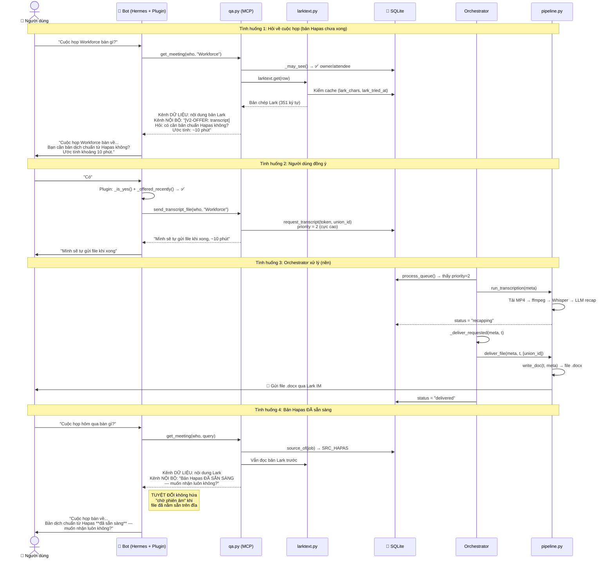

# Tài liệu kỹ thuật — Luồng tự động Meeting Note V2 (Lark × Whisper)

> Cập nhật mới nhất: **12/08/2026**<br>
> Repo: `D:\MeetingxLark`<br>
> Tài liệu này mô tả toàn bộ kiến trúc V2, máy trạng thái job, chuỗi xác minh quyền tham dự, hạ tầng OAuth Cloudflare, luồng hỏi đáp QA và các trần quyền API của Lark. Mọi chi tiết đều đã được kiểm chứng bằng dữ liệu thật và selftest (**730 PASS / 0 FAIL**).

---

## 0. Bảng tổng hợp toàn bộ luồng V2 hệ thống

| Tình huống / Sự kiện | Điều kiện kích hoạt | Xử lý kỹ thuật nội bộ | Kết quả / Người nhận | Quy tắc ACL & Bảo mật |
|---|---|---|---|---|
| **Phát hiện cuộc họp mới** | `scan_once()` quét `minutes_list()`, minute chưa có trong DB | Tự sinh mốc `first_seen`, chờ 3 phút (settle), gọi `try_claim_minute()` atomic | Tạo job `status=queued, priority=1` | Nguồn `calendar[near...]` bị loại hoàn toàn (fail-closed) |
| **Gửi thẻ DM "Họp xong"** | Cuộc họp mới (`notify=True`) | Giao `attendees ∩ enrolled_users`. Gọi `larktext.fetch()` thử thang token (`owner`→`attendees`→`viewers`) | Gửi thẻ DM cho người dự đã enroll. Có tóm tắt nếu chủ đã enroll; nghèo (link) nếu chủ chưa enroll | Người chưa enroll bị **bỏ qua** (skipped, 0 DM, 0 auth link) |
| **Chủ phòng chưa Enroll** | Minute được tạo bởi người dùng chưa nhắn bot | API Lark `minutes_transcript` trả 403 `2091005` cho token người dự | Job chuyển sang `waiting_auth` (parked), không retry nóng | Không dùng `minute_viewers` để cấp quyền |
| **Người dùng nhắn bot lần đầu** | Nhắn 1-1 ("Alo") và chưa có token trong DB | `gate.check()` trả `invite`. Sinh nonce TTL 24h, tạo short link OAuth | Gửi 1 thẻ chứa link OAuth 1-1 | Không tự gửi link auth chủ động cho bất kỳ ai khác |
| **Người dùng hoàn tất OAuth** | Đồng ý trên màn hình Lark | Cloudflare Worker đẩy callback vào Queue. `complete()` lưu token, gọi `reverify_after_enroll()`, `release_waiting_auth()`, `welcome_and_backlog()` | Đánh thức job `waiting_auth` → `queued (priority=0)`. Gửi thẻ chào 7 ngày | Backlog 90 ngày nạp im lặng (`notify=False`) |
| **Xử lý phiên âm nền (Whisper)** | Job ở `status=queued` trong `process_queue()` | Tải MP4 → ffmpeg ra WAV 16kHz PCM → Whisper medium (CPU) + glossary prompt → LLM recap | Lưu transcript `.json` & `.docx`, ghi Bitable Base, job sang `held` | Mô hình "Kéo" (Pull): **Không tự gửi file vào chat** |
| **Hỏi đáp danh sách cuộc họp** | Người dùng nhắn "Liệt kê cuộc họp" | MCP gọi `qa.list_meetings()`. Lọc hiển thị qua `_may_see()`. Đóng gói mốc `SEND_MARK` | Trả bảng danh sách (tối đa 12 dòng / 3.500 ký tự) | Chốt cứng 1 câu hỏi = 1 tin nhắn |
| **Hỏi chi tiết cuộc họp** | Người dùng hỏi "Cuộc họp X bàn gì?" | MCP gọi `qa.get_meeting()`. Lấy bản Lark/Hapas. Trả mốc `CONTEXT_MARK` & `OFFER_MARK` | Bot trả lời bằng bản Lark/Hapas + mời lấy file Word bản Hapas | Cổng `_claims_data` chặn agent bịa dữ liệu nếu không gọi tool |
| **Yêu cầu gửi file transcript** | Người dùng đồng ý ("Có", "Gửi đi") sau lời mời | Plugin nhận diện `_is_yes()`, mở cổng write-tool. Gọi `sendfile.send_transcript_file()` | Ghi `db.request_transcript()`, nâng `priority=2` | Bot tự gửi file `.docx` ngay khi Whisper xử lý xong |


### Sơ đồ Mermaid tổng quát toàn bộ luồng hệ thống (4 giai đoạn)



---

## 1. Kiến trúc tổng thể V2

Hệ thống V2 là một orchestrator đơn tiến trình (single-process) kết hợp cùng **SQLite mã hoá** (Fernet key), **Hermes Gateway** (kênh WebSocket chat 1-1) và **Cloudflare Worker + Queue** (xử lý OAuth callback).

### Sơ đồ ASCII (Xem trực tiếp trong bất kỳ trình đọc text nào)

```text
 +-----------------------------------------------------------------------------------+
 |                                 ☁️ LARK CLOUD                                      |
 |  [Minutes API]  [Calendar API]  [VC Recording API]  [IM Send API]  [Bitable Base] |
 +----------------------------------------+------------------------------------------+
                                          |
 +----------------------------------------v------------------------------------------+
 |                            ☁️ CLOUDFLARE INFRASTRUCTURE                           |
 |  Worker Callback (OAuth)  --->  Cloudflare Queue: meetingxlark-oauth              |
 +----------------------------------------+------------------------------------------+
                                          |
 +----------------------------------------v------------------------------------------+
 |                      🖥️ MÁY LOCAL (D:\MeetingxLark)                               |
 |                                                                                   |
 |  +-----------------------------------------------------------------------------+  |
 |  | ORCHESTRATOR (1 tiến trình duy nhất)                                        |  |
 |  | • scan_once()          : Quét Minutes, Calendar, VC                         |  |
 |  | • process_queue()      : Tải MP4 -> ffmpeg (WAV) -> Whisper (CPU) -> Recap |  |
 |  | • oauth.poll_pending() : Kéo Queue Cloudflare, lưu Token                      |  |
 |  | • alerts & backup      : Heartbeat 60s, Auto backup SQLite                  |  |
 |  +-------------------------------------+---------------------------------------+  |
 |                                        |                                          |
 |  +-------------------------------------+---------------------------------------+  |
 |  | DỮ LIỆU LOCAL                                                               |  |
 |  | • SQLite mã hoá (Fernet) : jobs, tokens, oauth_nonce, chat_memory             |  |
 |  | • Disk File System       : transcripts/*.docx, lark-*.txt                     |  |
 |  +-------------------------------------+---------------------------------------+  |
 |                                        |                                          |
 |  +-------------------------------------+---------------------------------------+  |
 |  | HERMES GATEWAY (Chat 1-1 qua WebSocket)                                     |  |
 |  | • v2-enroll-gate plugin  : Kiểm tra danh tính & cấp ticket                  |  |
 |  | • MCP Server (qa, send)  : Tra cứu dữ liệu họp & phát file .docx            |  |
 |  +-----------------------------------------------------------------------------+  |
 +-----------------------------------------------------------------------------------+
```

### Sơ đồ Mermaid đồ hoạ



---

## 2. Vòng lặp chính Orchestrator

```text
 [Khởi động] --> db.init() --> thread Heartbeat (60s)
      |
      v
 +--> [Đầu vòng lặp while True]
 |     - อ่าน .env (công tắc PAUSED)
 |     - oauth.poll_pending() (kéo Queue Cloudflare)
 |
 |    {PAUSED = True?} --Có--> alerts.check_all() --+
 |           |                                      |
 |          Không                                   |
 |           v                                      |
 |     - whisper_supervisor.ensure_running()        |
 |     - scan_once() (quét Minutes 7 ngày)          |
 |     - _backfill_base()                           |
 |     - process_queue() (xử lý hàng đợi job)       |
 |           |                                      |
 |           +--------------------------------------+
 |           v
 |     - alerts.check_all() & backup.maybe_backup()
 |     - _sleep_with_fast_enroll(300s) (ngủ 5 phút, nhưng poll mỗi 5s nếu có ai enroll)
 +-----------+
```



---

## 3. Luồng phát hiện cuộc họp → Tạo job → Thông báo

```text
  scan_once()
    |
    v
  [Quét Minutes 7 ngày của User Enrolled]
    |
    +--> Minute đã tồn tại? --Có--> Ghi viewer kỹ thuật (nếu đúng attendee)
    |
    +--> Minute MỚI ---> Chờ đủ 3 phút (settle)
                            |
                            v
                         gọi try_claim_minute() (khoá atomic)
                            |
                            v
                         meetings.resolve_participants() (xác minh Calendar/VC)
                            |
                            v
                         jobstore.create(status=queued, priority=1)
                            |
                            v
                         _notify_minute() (larktext.fetch -> LLM tóm tắt)
                            |
                            v
                         Gửi thẻ DM "Họp xong" cho người dự ĐÃ ENROLL
```



---

## 4. Máy trạng thái Job (Job State Machine)

```text
 [ enqueue_minute() ]
          |
          v
      ( queued ) <-----------------------+
        /   |  \                         |
       /    |   +---> ( waiting_auth ) --+ (release_waiting_auth khi có OAuth)
      /     v
     /  [ transcribing ]
    /     /      \
   /     v        v
  |  (failed)   [ recapping ]
  |                 /     \
  v                v       v
 (failed)       (held)   (delivered)
              (pull Q&A) (đã phát file)
```



---

## 5. Chuỗi xác minh người tham dự

```text
                      [ resolve_participants() ]
                                   |
                                   v
             [ Lấy các sự kiện lịch quanh ±3 giờ họp ]
                                   |
                                   v
            +---------------------------------------------+
            | Mức 1: VERIFIED (Mạnh nhất)                 |
            | VC recording có minute_token trùng chính xác |
            | --> Lấy danh sách mời + VC joiners (+vcN)    |
            +----------------------+----------------------+
                                   | (Nếu không khớp VC)
                                   v
            +---------------------------------------------+
            | Mức 2: TITLE (Vừa)                          |
            | Tên sự kiện lịch khớp CHÍNH XÁC tên minute  |
            | --> Lấy danh sách người được mời            |
            +----------------------+----------------------+
                                   | (Nếu chỉ gần giờ)
                                   v
            +---------------------------------------------+
            | Mức 3: REJECTED (Chặn)                      |
            | Chỉ gần giờ, tên lệch, VC lệch              |
            | --> BỎ QUA HOÀN TOÀN (Fail-closed)           |
            +---------------------------------------------+
```



---

## 6. Mô hình định danh của Lark (union_id vs open_id vs user_id)

| Loại ID | Định dạng | Phạm vi (Scope) | Sử dụng trong hệ thống |
|---|---|---|---|
| `union_id` | `on_...` | **Toàn tenant (xuyên app)** | **Định danh chính cho người dùng** (IM delivery, token mapping, ACL) |
| `open_id` | `ou_...` | Chỉ trong 1 app cụ thể | Gọi API cấp app (Minute/Calendar scope) |
| `user_id` | Chuỗi mã NV | Toàn công ty | Không dùng (yêu cầu quyền Danh bạ dư thừa) |

---

## 7. Luồng OAuth đăng ký (Cloudflare Worker + Queue)

```text
 User nhắn bot ("Alo")
   |
   v
 gate.check() ---> Chưa enroll ---> Thẻ đăng ký (chứa Short Link OAuth)
                                            |
                                            v
                                User bấm đồng ý trên Lark
                                            |
                                            v
                              Cloudflare Worker Callback
                                            |
                                            v
                              Cloudflare Queue (meetingxlark-oauth)
                                            |
                                            v
                              Orchestrator poll_pending() & complete()
                                            |
                                            v
                              Lưu token + reverify_after_enroll()
                              + release_waiting_auth()
                              + welcome_and_backlog() (Thẻ chào 7 ngày)
```



---

## 8. Luồng hỏi đáp: Gate → Plugin → QA



---

## 9. Trần quyền Lark Minutes API

```text
                    +------------------------------------+
                    |        LARK MINUTES API V1         |
                    +-----------------+------------------+
                                      |
              +-----------------------+-----------------------+
              |                                               |
              v                                               v
    [ CHỦ BẢN GHI (Owner) ]                       [ NGƯỜI DỰ (Attendee) ]
    • Metadata    : ✅ 200 OK                          • Metadata    : ✅ 200 OK
    • Transcript  : ✅ 200 OK                          • Transcript  : ❌ 403 (2091005)
    • Download MP4: ✅ 200 OK                          • Download MP4: ❌ 403 (2091005)
    • Summary API : ❌ 404 (Không tồn tại)            • Summary API : ❌ 404 (Không tồn tại)
```



---

## 10. Luồng gửi bản dịch (Pull Model) & Phân loại nguồn



---

## 11. Xử lý audio: MP4 → WAV 16kHz Mono PCM Lossless

- `minutes_media` chỉ trả video MP4 (AAC audio 44.1kHz/96kbps).
- **Tuyệt đối KHÔNG dùng MP3 32kbps**: Nén lossy làm mất dải tần âm thanh tiếng Việt có dấu, tạo ra nhiễu làm Whisper bị hiện tượng hallucination (lặp từ, nuốt chữ).
- **Lệnh nén chuẩn**:
  ```bash
  ffmpeg -i input.mp4 -vn -ac 1 -ar 16000 -c:a pcm_s16le -y output.wav
  ```
  - `-vn`: Bỏ video track.
  - `-ac 1`: Chuyển sang Mono.
  - `-ar 16000`: Resample về 16kHz (đúng chuẩn input Whisper).
  - `-c:a pcm_s16le`: Lossless PCM 16-bit (~1.8MB / phút).

---

## 12. Whisper & LLM Local

- Model: `whisper medium` chạy CPU local (server chính khuyên dùng GPU).
- Hiệu năng CPU: Tốc độ xử lý realtime ~0.58x (cuộc 10 phút mất ~18 phút xử lý).
- **Biasing qua Glossary**: Truyền danh sách thuật ngữ chuyên ngành (MCP, Claude, Node.js, Lark, terminal...) vào `initial_prompt` của Whisper để ngăn phiên âm sai ("cây lau", "mờ cp").

---

## 13. Cạm bẫy Windows & Lưu ý vận hành

1. **`lark-cli` trên Windows**: Là file batch `.cmd`, phải lấy path qua `shutil.which("lark-cli")` trong Python subprocess.
2. **Encoding UTF-8 & CRLF**: File `.bat` không được chứa ký tự Unicode có dấu để tránh bị nuốt chuỗi lệnh dòng đầu (`TRANSCRIPT_SOURCE` → `RANSCRIPT_SOURCE`). Sửa script tự động phải đảm bảo kết thúc bằng `\r\n`.
3. **Quyền riêng tư & Bảo mật**: Không gom user token hàng loạt. ACL local trong SQLite kiểm soát nghiêm ngặt `who` theo đúng attendee/owner đã xác minh.
